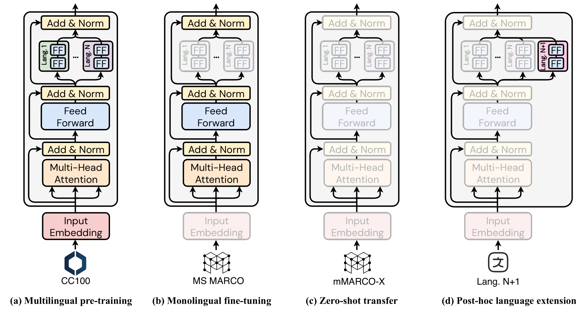

[](https://opensource.org/licenses/MIT)
[](https://www.python.org/downloads/)
[](https://arxiv.org/abs/2402.15059)
[](https://huggingface.co/antoinelouis/colbert-xm)
[](https://huggingface.co/antoinelouis/dpr-xm)

# Zero-Shot Multilingual Information Retrieval with Modular Retrievers

This repository contains the code for reproducing the experimental results presented in the paper ["ColBERT-XM: A Modular Multi-Vector Representation Model for Zero-Shot Multilingual Information Retrieval"](https://arxiv.org/abs/2402.15059) by [Antoine Louis](https:/antoinelouis.co/work/), [Vageesh Saxena](https://www.maastrichtuniversity.nl/vk-saxena), [Gijs van Dijck](https://www.maastrichtuniversity.nl/gijs.vandijck), and [Jerry Spanakis](https://dke.maastrichtuniversity.nl/jerry.spanakis/).



State-of-the-art neural retrievers predominantly focus on high-resource languages like English, which impedes their adoption in retrieval scenarios involving other languages. Current approaches circumvent the lack of high-quality labeled data in non-English languages by leveraging multilingual pretrained language models capable of cross-lingual transfer. However, these models require substantial task-specific fine-tuning across multiple languages, often perform poorly in languages with minimal representation in the pretraining corpus, and struggle to incorporate new languages after the pretraining phase. In this work, we present a novel modular dense retrieval model that learns from the rich data of a single high-resource language and effectively zero-shot transfers to a wide array of languages, thereby eliminating the need for language-specific labeled data. Our model, ColBERT-XM, demonstrates competitive performance against existing state-of-the-art multilingual retrievers trained on more extensive datasets in various languages. Further analysis reveals that our modular approach is highly data-efficient, effectively adapts to out-of-distribution data, and significantly reduces energy consumption and carbon emissions. By demonstrating its proficiency in zero-shot scenarios, ColBERT-XM marks a shift towards more sustainable and inclusive retrieval systems, enabling effective information accessibility in numerous languages.

## Documentation

Detailed documentation on the dataset and how to reproduce the main experimental results can be found [here](docs/README.md).

## Citation

For attribution in academic contexts, please cite this work as:

```latex
@article{louis2024modular,
  author = {Louis, Antoine and Saxena, Vageesh and van Dijck, Gijs and Spanakis, Gerasimos},
  title = {ColBERT-XM: A Modular Multi-Vector Representation Model for Zero-Shot Multilingual Information Retrieval},
  journal = {CoRR},
  volume = {abs/2402.15059},
  year = {2024},
  url = {https://arxiv.org/abs/2402.15059},
  doi = {10.48550/arXiv.2402.15059},
  eprinttype = {arXiv},
  eprint = {2402.15059},
}
```

## License

This repository is MIT-licensed.
